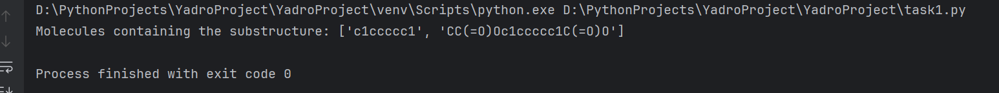

# Project Yadro

## Task 1

Вывод результата функции из Task1



## Task 2

В Task2 из директории src для запуска выполните команду ```uvicorn task2:app --reload```

## Task 3

В Task 3 для запуска из корня проекта вызовите команды: ```docker-compose build``` 
и ```docker-compose up -d```